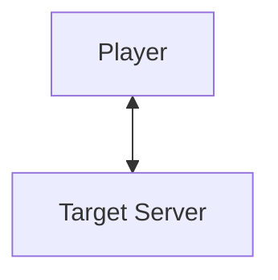
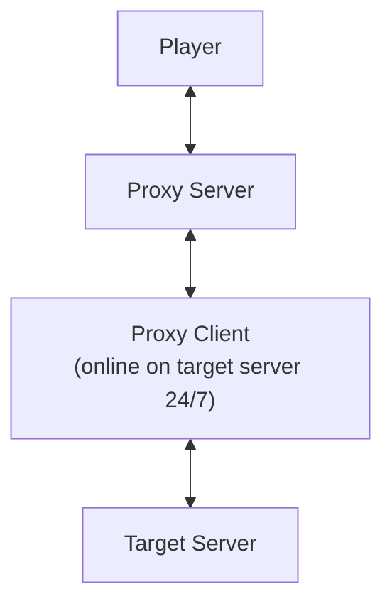

# Block Game Proxy (BGP)

A rather simple Minecraft proxy that keeps a persistent connection to a target server so your account appears online
24/7. BGP
runs a proxy client that stays connected to the target (acting as a bot when idle) and a proxy server that accepts a
single player connection and forwards gameplay traffic between that player and the target.

## Diagram

### Normal



### BGP



## What it does

- Keeps a live connection to a target server even with one online.
- Lets one player connect to the proxy; that player’s actions are relayed to the target server and world data is relayed
  back.
- If you disconnect, the client stays connected as a bot and restores the world when you reconnect.

## Installation

1. **Download** the latest release `.jar` file from the [Releases](https://github.com/0x1bd/BlockGameProxy/releases/)
   page.
   *(Alternatively, you can build from source using Gradle —
   see [Building from Source](#building-from-source-optional)
   below.)*
2. **Create a new folder** for BGP and place the downloaded JAR inside it.
3. **Run BGP for the first time** to generate the config file:

   ```bash
   java -jar BlockGameProxy-<version>.jar
   ```

   *(Replace `<version>` with the actual version number of your downloaded JAR.)*
4. After the first run, a file named `config.json` will appear in the same directory.
   Open it and fill in your Minecraft credentials and target server information.
5. **Restart** BGP:

   ```bash
   java -jar BlockGameProxy-<version>.jar
   ```

   Your proxy instance should now start up and maintain a persistent connection to the target server.

---

### Running with debug logs

If you want to see debug information from BGP run it with the `-Dlog.level=DEBUG` argument:

```bash
java -Dlog.level=DEBUG -jar BlockGameProxy-<version>.jar
```

### Building from source (Optional)

If you prefer to build manually:

```bash
git clone https://github.com/0x1bd/BlockGameProxy.git
cd BlockGameProxy
./gradlew build
```

The compiled JAR will be located in:

```
build/libs/BlockGameProxy-<version>.jar
```

---